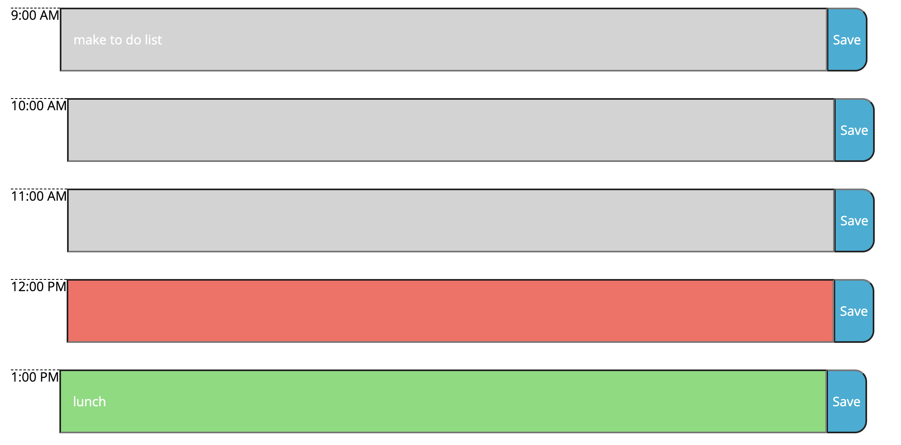

# Work Day Scheduler Starter Code

 

I added the appropriate classes to my newly created HTML divs.  Today's date is shown at the top of the page with the help of Moment().

Moment() is used again to find the difference between the time right now and if a timeblock comes before or after.  These elements are color-coded with the provided classes.

Then, an event listener is added to each button and they store whatever is in the input into local storage.  Then it will keep it the input by getting the item from local storage and applying that value.

<a href="https://sacylkowski.github.io/task-calendar/">Here is the link to the webpage</a>
